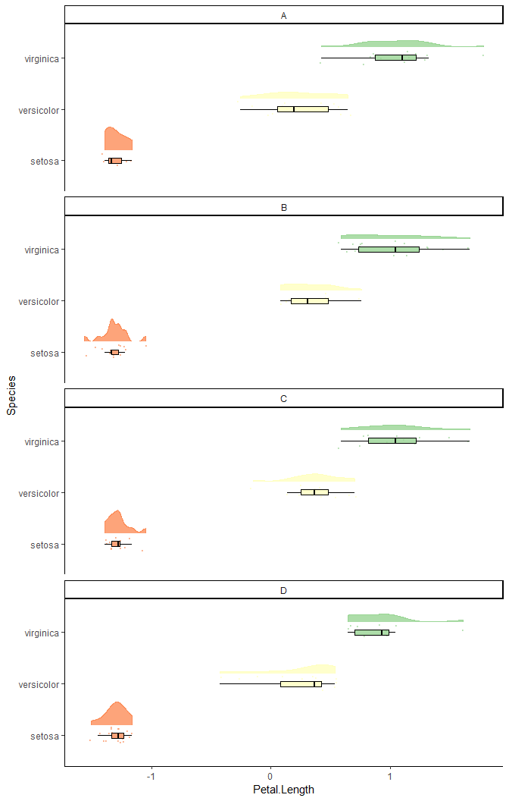

Raincloud plots with built-in geoms for ggplot2
================

The following is an example of creating raincloud plots without the need of sourcing custom geoms and the `raincloud_theme`. I came up with this as a way to teach raincloud plots to R beginners, as long as there is no built-in raincloud geom in `ggplot2`.

If you are not familiar with raincloud plots have a look at the extensive [preprint (Allen et al., 2018)](https://peerj.com/preprints/27137/) or read a condensed version at [Micah Allen's blog](https://micahallen.org/2018/03/15/introducing-raincloud-plots/?utm_campaign=News&utm_medium=Community&utm_source=DataCamp.com). As already mentioned, the approach there requires sourcing the custom `geom_flat_violin` from [this R-script](https://gist.githubusercontent.com/benmarwick/2a1bb0133ff568cbe28d/raw/fb53bd97121f7f9ce947837ef1a4c65a73bffb3f/geom_flat_violin.R) and an optional theme provided by Allen et al., which is a handy approach for everyone who is a seasoned R analyst. However, I wanted similar results with code of which I think it might be more comprehensible for ggplot beginners, so this is what I came up with:

``` r
library("ggplot2")

ggplot(data = diamonds, 
       aes(x = cut, 
           y = price, 
           fill = cut,
           colour = cut)) +
  geom_violin(alpha = .8, 
              position = position_nudge(x = .2, y = 0)) +
  stat_ydensity(geom = "bar", colour = "white", fill = "white", width = .5,
                position = position_nudge(x = -.05, y = 0)) +
  geom_jitter( width = .15, 
               size = .5, 
               alpha = 0.5) +
  geom_boxplot(width = 0.1, 
               outlier.shape = NA, 
               alpha = 0.8,
               color = "black") +
  coord_flip(ylim = c(min(diamonds$price),max(diamonds$price))) +
  theme_classic() +
  theme(legend.position = "none") +
  scale_color_brewer(palette = "Spectral") +
  scale_fill_brewer(palette = "Spectral") 
```


The magic happens in the layer after the `geom_violin`. I was able to utilize the output from the the violin plot's y dimension stat to stretch a `geom_bar` to the same length on the y axis.

Here is the same plot with a red border around the 'hidden' bars.


This approach also works nicely with different numbers of groups. Unfortunately, I had to force limits on the y axis in `coord_flip`, because the bars always started at zero.

``` r
ggplot(data = mpg, 
       aes(x = as.factor(cyl), 
           y = cty, 
           fill = as.factor(cyl),
           colour = as.factor(cyl))) +
  geom_violin(alpha = .8, 
              position = position_nudge(x = .2, y = 0)) +
  stat_ydensity(geom = "bar", colour = "white", fill = "white", width = .5,
                position = position_nudge(x = -.05, y = 0)) +
  geom_jitter( width = .15, 
               size = .5, 
               alpha = 0.5) +
  geom_boxplot(width = 0.1, 
               outlier.shape = NA, 
               alpha = 0.8,
               color = "black") +
  coord_flip(ylim = c(min(mpg$cty),max(mpg$cty))) +
  theme_classic() +
  theme(legend.position = "none") +
  scale_color_brewer(palette = "Spectral") +
  scale_fill_brewer(palette = "Spectral") 
```


Another drawback of this approach is that it cannot be used with a background grid and the clouds cannot have black outlines. Yet, it works perfectly with the `facet_wrap` from `ggplot2` and negative values.

``` r
iris_exp <- iris
iris_exp$group <- sample(LETTERS[1:4], 150, replace = TRUE)
iris_exp$Petal.Length <- scale(iris_exp$Petal.Length)

ggplot(data = iris_exp, 
       aes(x = Species, 
           y = Petal.Length, 
           fill = Species,
           colour = Species)) +
  geom_violin(alpha = .8, 
              position = position_nudge(x = .2, y = 0)) +
  stat_ydensity(geom = "bar", colour = "white", fill = "white", width = .5,
                position = position_nudge(x = -.05, y = 0)) +
  geom_jitter( width = .15, 
               size = .5, 
               alpha = 0.5) +
  geom_boxplot(width = 0.1, 
               outlier.shape = NA, 
               alpha = 0.8,
               color = "black") +
  coord_flip(ylim = c(min(iris_exp$Petal.Length),max(iris_exp$Petal.Length))) +
  theme_classic() + 
  theme(legend.position = "none") +
  facet_wrap(. ~ group, ncol = 1) +
  scale_color_brewer(palette = "Spectral") +
  scale_fill_brewer(palette = "Spectral") 
```



Please feel free to use this code snippets in your own scripts and teaching. If you want to make them more beautiful for slides I suggest using `ggsave()` with `type = "cairo-png"` as mentioned [here](https://www.r-bloggers.com/using-cairographics-with-ggsave/).
